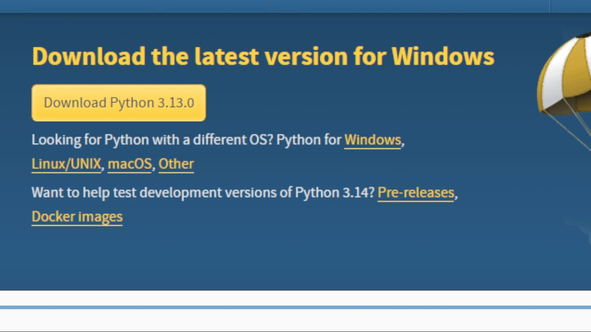
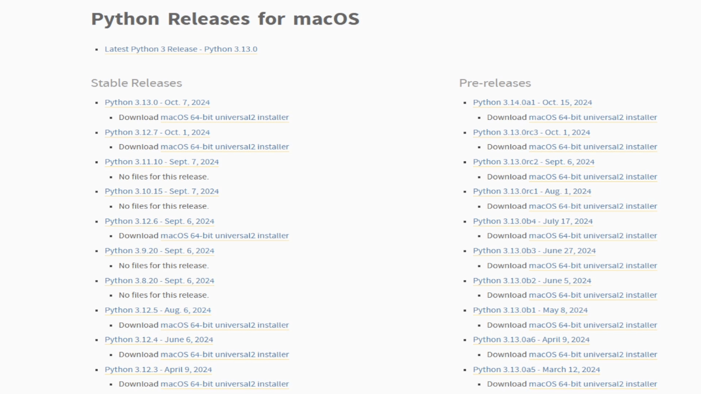
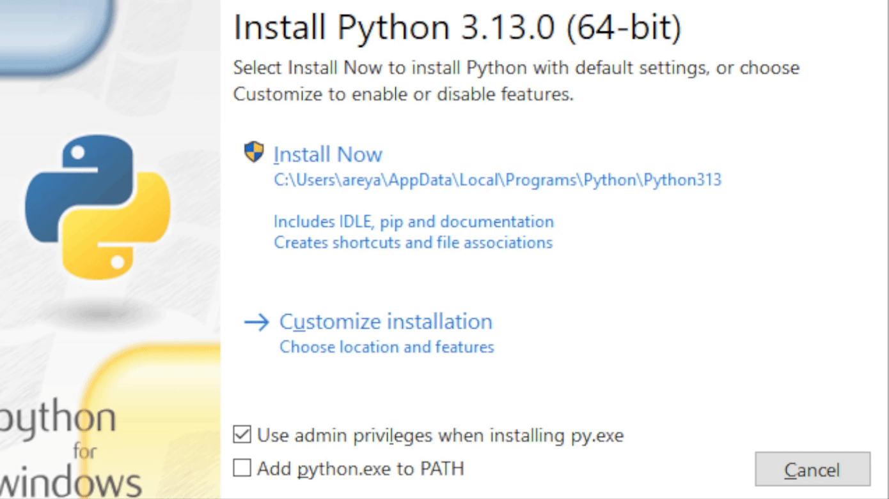
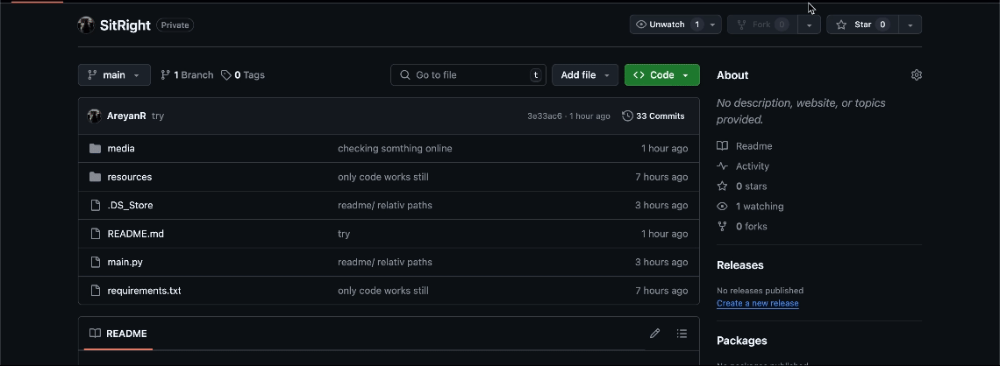
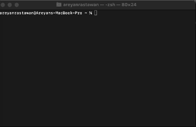
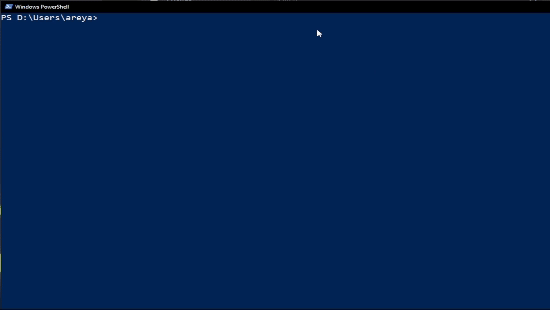

# SitRight: Posture Reminder Application

## Table of Contents
- [Introduction](#introduction)
- [Features](#features)
- [Prerequisites](#prerequisites)
- [macOS Installation Guide](#macos-installation-guide)
- [Windows Installation Guide](#windows-installation-guide)
- [Usage Guide](#usage-guide-for-sitright)
- [Why I Created SitRight](#why-i-created-sitright) 
- [Why Use SitRight?](#why-use-sitright)
- [How it Works](#how-it-works)
- [Dependencies](#dependencies)
- [Contact](#contact)


## Introduction

**SitRight** is a cross-platform program that helps you sit better. It uses your webcam to monitor posture and reminds you to sit correctly. Easy to use, runs in the background, and works on macOS and Windows. SitRight aims to encourage healthy posture habits in an era when many of us spend long hours at desks.

## Features


* **Posture Monitoring**: Real-time feedback via webcam.
* **Cross-Platform**: Works on macOS and Windows.
* **Simple Interface**: Easy and modern GUI.
* **Background Application**: Does not interfere with work


## Prerequisites

1. **Python Installation Required**
   * Download Python 3.7 or higher for your operating system:

   ### Windows Python Installation - [link](https://www.python.org/downloads/)
   

   ### Mac Python Installation - [link](https://www.python.org/downloads/macos/)
   

   ### Important Setup Note
   * During Windows installation, make sure to check "Add Python to PATH"
   
   

2. **Webcam Required**
   * Built-in laptop webcam or external USB webcam


> Note: The application works best when webcam is postioned infront of you.


## macOS Installation Guide

### Steps

1. **Download and Extract**
   * Download the SitRight zip file
   * Move and Extract (unzip) the file to your Desktop
   >Note: The folder is required to in your desktop for the next commaand to work

   


2. **Open Terminal**
   * Find Terminal in Applications > Utilities or use `Cmd + Space` to search
   
   

3.
   **Move to application folder**
   ```bash
   cd Desktop/SitRight-main
   ```

4. **Install Dependencies** (One-time setup)
   ```bash
   pip3 install -r requirements.txt
   ```

5. **Launch the App**
   ```bash
   python3 main.py
   ```

>**Note:** You only need to install the dependencies (Step 4) once during the initial setup. 

> For future use, start at Step 1, go to Step 3, and then jump directly to Step 5.




## Windows Installation Guide

### Steps

1. **Open Command Prompt**
   * search for "Windows Powershell" in the Start menu

   
   

2. **Download and Extract**
   * Download the SitRight zip file
   * Exact all the ocntencts into the desktop (important)

    

3. **Navigate to application**
   * In Command Prompt, first go to your Desktop:
   ```cmd
   cd Desktop/Sitright-main/Sitright-main
   ```

4. **Install Dependencies** (One-time setup)
   ```cmd
   pip install -r requirements.txt
   ```

5. **Launch the App**
   ```cmd
   python main.py 
   ```
   or 
   
   ```cmd
   py main.py 
   ``` 


> **Note:** You only need to install the dependencies (Step 4) once during the initial setup.  

> For future use, start at Step 1, go to Step 3, and then jump directly to Step 5.


> Tip: If you get a "python not found" error, try using `py` instead of `python` in the commands above.



## Usage Guide for SitRight

### 1. Launch Application
* Click the "Start Monitoring" button in the interface
* The webcam feed will automatically open in a new window

### 2. Set Reference Posture
* Sit in your ideal upright position
* Press **B** in the webcam window to capture your refrence posture
* A confirmation message will appear when your reference is set

### 3. Active Monitoring
* Once your reference posture is set, monitoring begins automatically
* You can freely switch to other applications or tabs
* SitRight will continue running in the background
* The system will alert you when your posture needs adjustment

### 4. End Session
* To stop monitoring, return to the webcam window
* Press **Q** to quit the application

**Note:** The webcam window must be active/focused when using keyboard shortcuts (**B** and **Q**).


## Why I Created SitRight

As someone passionate about technology, I spend countless hours at the computer. Maintaining good posture has always been a challenge—it's too easy to get absorbed in work and forget about sitting properly.

I created **SitRight** to tackle this issue, both for myself and for others struggling to maintain good posture. It's a simple, accessible, and free solution designed to help anyone who spends long hours seated stay mindful of their posture and avoid discomfort or long-term health problems.

## Why Use SitRight?

* **Free**: SitRight is completely free to use.
* **Cross-Platform**: Works seamlessly on both macOS and Windows.
* **User-Friendly**: Simple setup and intuitive to use, even for beginners.
* **Convenient**: Runs quietly in the background without disrupting your work or activities.


## How it Works

### Initialization and Interface
* **Main Menu**: Simple GUI with options to start monitoring, view instructions, or learn about the project.

### Posture Monitoring
* **Webcam Setup**: Activates webcam for real-time video feed and detects faces.
* **Baseline Posture**: Captures a reference for good posture (head height and position).
* **Active Monitoring**: Continuously tracks posture and calculates deviations.

### Alerts and Notifications
* **Triggers**: Alerts for significant head height or position changes.
* **Cross-Platform Support**:
 * **macOS**: Native system notifications via `osascript`.
 * **Windows**: Alerts via `plyer`.

### Visual Feedback (Camera Tab)
* **Bounding boxes**: Show face detection.
* **Status Messages**:
 * Red: "Reference posture not set"
 * Green: "Reference posture set"
* **Instructions**: Visible controls for setting posture (**B**) and quitting (**Q**).

### Dependencies
* **customtkinter**: Creates a modern, customizable GUI.
* **cv2 (OpenCV)**: Handles webcam access and real-time video processing.
* **mediapipe**: Detects and tracks facial features for posture monitoring.
* **plyer**: Sends system notifications for posture adjustment reminders.
* **Pillow**: Processes images and animations like the splash screen GIF.
* **numpy**: Calculates averages for accurate posture monitoring.


## Contact

**Author**: Areyan Rastawan  
**LinkedIn**: [Areyan Rastawan](https://www.linkedin.com/in/areyan-rastawan-bb757a259/)  
**GitHub**: [AreyanR](https://github.com/AreyanR?tab=repositories)  
**Portfolio**: [Personal Website](https://ix.cs.uoregon.edu/~areyanr/)

---

Thank you for using SitRight