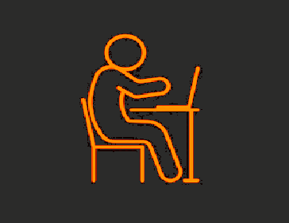

# SitRight: Posture Reminder Application
<div align="center">
  
</div>

## Table of Contents
- [Introduction](#introduction)
- [Features](#features)
- [Prerequisites](#prerequisites)
- [macOS Installation Guide](#macos-installation-guide)
- [Windows Installation Guide](#windows-installation-guide)
- [Usage Guide](#usage-guide-for-sitright)
- [Why I Created SitRight](#why-i-created-sitright) 
- [Why Use SitRight?](#why-use-sitright)
- [How it Works](#how-it-works)
- [Dependencies](#dependencies)
- [Contact](#contact)

## Introduction

**SitRight** is a cross-platform program that helps you maintain posture while using the computer. It uses your webcam to monitor posture and reminds you to sit correctly. It's easy to use, runs in the background, and works on both macOS and Windows. SitRight aims to encourage healthy posture habits in an era when many of us spend long hours at desks.

## Features

* **Posture Monitoring**: Real-time feedback via webcam
* **Cross-Platform**: Works on macOS and Windows
* **Simple Interface**: Easy and modern GUI
* **Background Application**: Does not interfere with work

## Prerequisites

### 1. Python Installation Required
* Download Python 3.7 up to 3.11 for your operating system
* Use these official links for the correct versions:

#### Windows Python Installation
* [Direct Download Link](https://www.python.org/downloads/release/python-31110/)
* Or visit [Official Page](https://www.python.org/downloads/)
 


#### Mac Python Installation
* [Direct Download Link](https://www.python.org/ftp/python/3.11.9/python-3.11.9-macos11.pkg)
* Or visit [Official Page](https://www.python.org/downloads/macos/)


#### Important Setup Note (Windows Only)
* During Windows installation, make sure to check "Add Python to PATH"
   


### 2. Webcam Required
* Built-in or external USB webcam
* Laptop webcam works fine too

> 💡 Tip: The application works best when the webcam is positioned in front of you.

## macOS Installation Guide

> Please make sure you have completed the [Prerequisites](#prerequisites) first

### Steps

1. **Download and Extract**
   * Download the SitRight zip file from the top of this page
   * Move and Extract (unzip) the file to your Desktop

   

2. **Open Terminal**
   * Find Terminal in Applications > Utilities
   * Or use Spotlight Search: press `Cmd + Space` and type "Terminal"
   
   

3. **Installation Commands**

First-time setup (copy entire block):
```bash
cd Desktop/SitRight-main
python3 -m pip install -r requirements.txt
python3 main.py
```
Quick start for future use (copy entire line):
```bash
cd Desktop/SitRight-main && python3 main.py
```

>Note: Only use the setup command once. For future use, open a new terminal, run the quick start command.


## Windows Installation Guide

> Please make sure you have completed the [Prerequisites](#prerequisites) first

### Steps

1. **Open PowerShell**
   * Search for "Windows PowerShell" in the Start menu

   

2. **Download and Extract**
   * Download the SitRight zip file
   * Extract all contents to your Desktop

   

3. **Installation Commands**

First-time setup (copy entire block):
```cmd
cd Desktop/SitRight-main
python -m pip install --upgrade pip
python -m pip install -r requirements.txt
python main.py
```

Quick start for future use (copy entire line):
```cmd
cd Desktop/SitRight-main && python main.py
```

If "python not found" error occurs, use these commands instead:

First-time setup (copy entire block):
```cmd
cd Desktop/SitRight-main
py -m pip install --upgrade pip
py -m pip install -r requirements.txt
py main.py
```

Quick start with py (copy entire line):
```cmd
cd Desktop/SitRight-main && py main.py
```
>Note: Only use the setup command once. For future use, open a new Powershell run the quick start command.


## Usage Guide for SitRight

> **Important**: Make sure your machine is not in Do Not Disturb/Focus mode

### 1. Launch Application
* Click the "Start Monitoring" button
* The webcam feed will open in a new window

### 2. Set Reference Posture
* Sit in your ideal upright position
* Press **B** in the webcam window
* You'll see a confirmation when your reference is set

### 3. Active Monitoring
* Monitoring starts automatically after setting reference
* You can use other applications normally
* SitRight runs quietly in the background
* You'll get alerts when your posture needs fixing

### 4. End Session
* Go back to the webcam window
* Press **Q** to quit

> **Note**: The webcam window must be active when using keyboard shortcuts (**B** and **Q**)

## Why I Created SitRight

As someone passionate about technology, I spend countless hours at the computer. Maintaining good posture has always been a challenge, it's too easy to get absorbed in work and forget about sitting properly.

I created **SitRight** to tackle this issue, both for myself and for others struggling to maintain good posture. It's a simple, accessible, and free solution designed to help anyone who spends long hours seated stay mindful of their posture and avoid discomfort or long-term health problems.

## Why Use SitRight?

* **Free**: SitRight is completely free to use
* **Cross-Platform**: Works seamlessly on both macOS and Windows
* **User-Friendly**: Simple setup and intuitive to use, even for beginners
* **Convenient**: Runs quietly in the background without disrupting your work or activities

## How it Works

### Initialization and Interface
* **Main Menu**: Simple GUI with options to start monitoring, view instructions, or learn about the project

### Posture Monitoring
* **Webcam Setup**: Activates webcam for real-time video feed and detects faces
* **Reference Posture**: Captures a reference for good posture (head height and position)
* **Active Monitoring**: Continuously tracks posture and calculates deviations

### Alerts and Notifications
* **Triggers**: Alerts for significant head height or position changes
* **Cross-Platform Support**:
  * **macOS**: Native system notifications via `osascript`
  * **Windows**: Alerts via `plyer`

### Dependencies
* **customtkinter**: Creates a modern, customizable GUI
* **cv2 (OpenCV)**: Handles webcam access and real-time video processing
* **mediapipe**: Detects and tracks facial features for posture monitoring
* **plyer**: Sends system notifications for posture adjustment reminders
* **Pillow**: Processes images and animations like the splash screen GIF
* **numpy**: Calculates averages for accurate posture monitoring

## Known Issues

On macOS, the first camera access attempt might fail while the system asks for permission. Just click "Start Monitoring" again after allowing camera access.

## Contact

**Author**: Areyan Rastawan  
**LinkedIn**: [Areyan Rastawan](https://www.linkedin.com/in/areyan-rastawan-bb757a259/)  
**GitHub**: [AreyanR](https://github.com/AreyanR?tab=repositories)  
**Portfolio**: [Personal Website](https://ix.cs.uoregon.edu/~areyanr/)  
**Email**: areyanr@hotmail.com